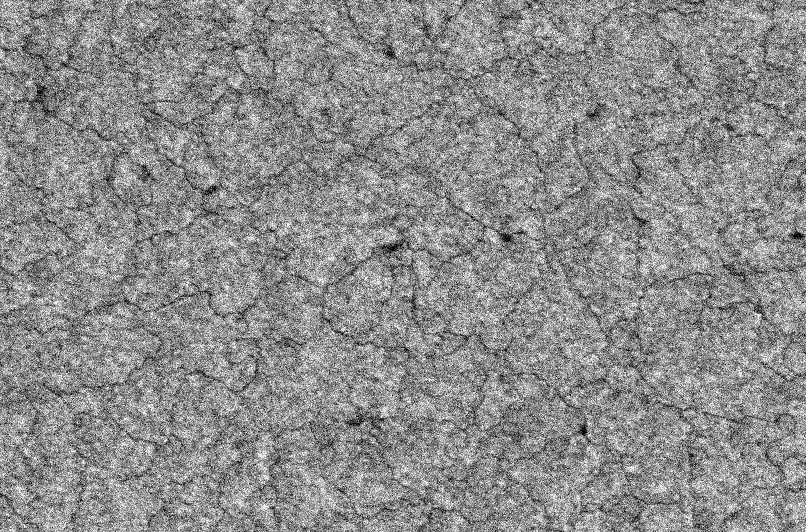
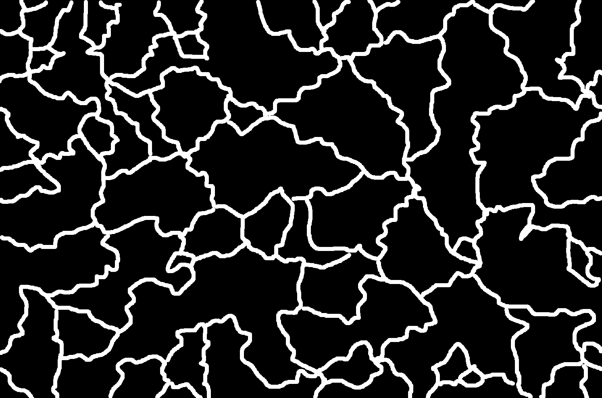
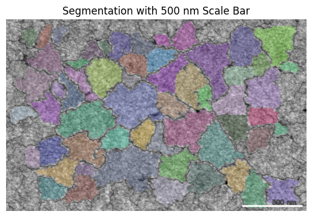
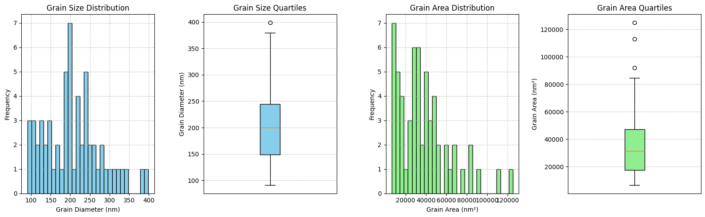

# SEM Grain Segmentation (Automated)

Tools for processing SEM plane-view images and detecting grain boundaries via a pixel-wise machine learning classifier, followed by robust post-processing and grain statistics reporting.

---
## Key Features
- **ImageJ/Fiji-based labeling workflow** to prepare binary grain-boundary labels.
- **Feature extraction** using `scikit-image` multiscale basic features.
- **Random Forest pixel classifier** with stratified cross-validation and grid search.
- **Prediction pipeline** to generate binary grain-boundary masks from new SEM images.
- **Post-processing & analysis** to separate touching grains, clean labels, compute statistics, and auto-generate a PDF report.

---
## Repository Structure
```
.
├── preprocess_train_CV3.ipynb        # Train the pixel classifier
├── predict.ipynb                     # Run inference on a test image
├── postprocess_analysis.ipynb        # Clean prediction and analyze grains
├── BSSEM_utils.py                 # Utility functions (expected in repo)
├── requirements.txt               # Pip environment
├── environment.yml                # Conda environment (mini-proj)
└── image_files/
    └── <dataset_name>/
        ├── train_image.tif        # Training image
        ├── train_labels.tif       # Binary labels (white=GBs, black=grains)
        ├── <sample_name>_test.tif # Preprocessed test image (created by predict.ipynb)
        ├── <sample_name>_predict_GBs.tif
        └── <sample_name>_seg_result.tif
```

---
## Setup

### Option 1: Conda (Recommended)
1. Install [Miniconda](https://docs.conda.io/en/latest/miniconda.html)
2. Create the environment and activate
   ```bash
   conda env create -f environment.yml
   conda activate mini-proj
   ```

### Option 2: venv + pip
1. Create & activate the venv:
   ```bash
   python -m venv sem_seg
   # Windows
   sem_seg\\Scripts\\activate
   # macOS/Linux
   source sem_seg/bin/activate
   ```
2. Install requirements:
   ```bash
   python -m pip install -r requirements.txt
   ```

---
## Data Preparation (ImageJ/Fiji)
1. Open your SEM plane-view image.
2. **Delineate grain boundaries** with a white brush (value 255).
3. Apply threshold/contrast so background grains become black (value 0).
4. Save as `train_labels.tif`. Save the original (or flattened) image as `train_image.tif`.

> The training script will convert labels to (0, 1) automatically.

<p align="center">
  
  
</p>
``

---
## Quickstart (Scripts)

### 1) Train the Pixel Classifier
Run the training script (edit paths if needed):
```bash
python preprocess_train_CV3.
```
This will:
- Load `train_image.tif` and `train_labels.tif`.
- Extract multiscale intensity/texture/edge features.
- Fit a **Random Forest** with stratified 3-fold cross-validation (`GridSearchCV`).
- Save the best model as `best_pixel_classifier.joblib`.
- Show feature importance and example predictions.

**Inputs**
- `image_files/<dataset>/train_image.tif`
- `image_files/<dataset>/train_labels.tif`

**Outputs**
- `best_pixel_classifier.joblib` in the repository root.
- Diagnostic plots (feature maps, heatmaps, importance).

### 2) Predict Grain Boundaries on a New Image
Update the variables at the top of `predict.ipynb`:
- `image_dir` (e.g., `../image_files/AG103-A`)
- `image_filename` (e.g., `AG103-A-50K-002`)

Then run:
```bash
python predict.ipynb
```
This will:
- Load the specified image, grayscale/normalize, optionally flatten background.
- Extract features and load the classifier.
- Save a binary prediction: `<sample_name>_predict_GBs.tif` (1 = GBs, 0 = grains/background).
- Also save `<sample_name>_test.tif` (preprocessed image crop used for prediction).

> If you trained with `preprocess_train_CV3.ipynb`, rename `best_pixel_classifier.joblib` to `simple_pixel_classifier.joblib` **or** edit `predict.ipynb` to load `best_pixel_classifier.joblib`.

### 3) Post-process & Analyze Grains
Run:
```bash
python postprocess_analysis.ipynb
```
This will:
- Remove salt noise and optionally connect broken boundary dots.
- Invert to grain regions and separate touching grains (distance map + watershed).
- Fill holes, remove small objects, and clear border artifacts.
- Compute grain statistics (area, axes, aspect ratio), plot distributions.
- Create an overlay on the original image with a simple scale bar.
- Save a PDF report with all statistics and figures.

**Outputs**
- `<sample_name>_seg_result.tif` (overlay)
- `grain_analysis_<sample_name>.pdf` (report)
- CSVs/plots as implemented in `BSSEM_utils.py`.

<p align="center">
  
  
</p>
``

---
## Configuration & Tunables
- **Scale factor**: `SCALE_FACTOR` (pixel/nm) — update to match your microscope calibration.
- **Background removal**: structuring element size (`selem_size`) and Gaussian `sigma`.
- **Watershed separation**: `min_distance`, number of erosions.
- **Cleaning**: opening radius, `min_size`, `max_hole_size`.
- **File paths**: `image_dir`, `image_filename` at the top of scripts.

---
## Dependencies
Core libraries:
- `numpy`, `scikit-image`, `scikit-learn`, `matplotlib`, `joblib`, `pandas`, `opencv-python` (for some utilities), `scipy`.
Install via `environment.yml` (conda) or `requirements.txt` (pip).

---
## BSSEM_utils
`postprocess_analysis.py` expects a `BSSEM_utils.py` module providing functions such as:
- `apply_opening`, `connect_boundary_dots`, `separate_touching`,
- `fill_grain_holes`, `remove_small_objects`, `visualize_labeled`,
- `analyze_grains`, `save_grain_analysis`, `visualize_grain_statistics`,
- `visualize_overlay`, `add_simple_scale_bar`, `generate_grain_analysis_report`.
Place `BSSEM_utils.py` in the repository root or add it to `PYTHONPATH`.

---
## Tips & Troubleshooting
- **Model file name mismatch**: If prediction script looks for `simple_pixel_classifier.joblib` but your training saved `best_pixel_classifier.joblib`, rename or edit the loader.
- **All-black prediction image**: This is expected—GBs are sparse white pixels/lines on a black background. Inspect with contrast stretching or overlay visualization.
- **Class imbalance**: Labels with few GB pixels are imbalanced; the training script uses class weights. Consider annotating additional regions.
- **Paths**: Relative paths assume `image_files/<dataset_name>` one level up from the scripts; adjust if your layout differs.

---

## Acknowledgments
Thanks to ImageJ/Fiji and the open-source Python ecosystem.
